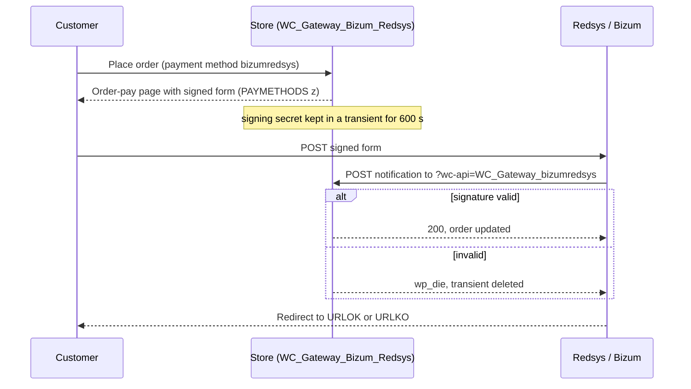

# Flow — Bizum payment (`bizumredsys`)

> As-built, written from the code on 2026-10-06. Steps marked *(unverified)* are read from the code and have no automated test.

## Trigger / entry point
A customer chooses the payment method with ID `bizumredsys` on the WooCommerce checkout and places the order.

## Actors
- **Customer** — browser, and their bank's Bizum confirmation.
- **Store** — WordPress + WooCommerce + this plugin (`WC_Gateway_Bizum_Redsys`).
- **Redsys** — the hosted Bizum page and the notification sender.

## Preconditions
- The gateway is enabled and the store currency is in the allowed list (`is_valid_for_use()`).
- When `transactionlimit` is set, the cart total is below it (`disable_bizum()`, `AC-24`).
- A SHA-256 secret is configured for the active mode; without one every notification is rejected (`AC-19`).

## Steps

1. **Customer → Store:** places the order. WooCommerce creates it `pending`; `process_payment()` returns a redirect to the order-pay URL.
2. **Store → Customer:** `woocommerce_receipt_bizumredsys` runs `receipt_page()`, which prints the form built by `generate_redsys_form()`.
3. **Store (building the request):** `get_redsys_args( $order )`:
   - creates the Redsys order number with `WCRedL()->prepare_order_number()`;
   - picks the signing secret with `get_redsys_sha256( $user_id )` (see "Branches");
   - sets the same parameter set as the card gateway, with `DS_MERCHANT_PAYMETHODS` fixed to `z`, the description from `WCRedL()->product_description()`, and no PSD2 block;
   - stores the secret it signed with in the transient `redsys_signature_<Redsys order number>` for 600 seconds, so the notification can be verified against the same secret;
   - passes the three signed fields through the filter `woocommerce_redsys_args` — the same filter name the card gateway uses.
4. **Store → Customer:** the form `#redsys_payment_form` posts `Ds_SignatureVersion`, `Ds_MerchantParameters` and `Ds_Signature` to the URL chosen by `get_redsys_url_gateway( $user_id )` — the Redsys test host in test mode, the live host otherwise — and is auto-submitted by an inline script (`AC-17`).
5. **Customer → Redsys:** confirms the payment with Bizum.
6. **Redsys → Store:** posts the notification to `?wc-api=WC_Gateway_bizumredsys`. Continues in `docs/flows/notification-handling.md`.
7. **Redsys → Customer → Store:** returns the customer to the order-received URL or to the cancel-order URL.

## Order states

| From | Event | To |
|------|-------|----|
| — | order placed | `pending` |
| `pending` | accepted notification, authorised, amount matches | status set by `payment_complete()`; then `completed` when `orderdo` is `completed` (`AC-21`) |
| `pending` | accepted notification, authorised, amount differs | `on-hold` (`AC-23`) |
| `pending` | accepted notification, denied | `cancelled`, error text stored in `_redsys_error_payment_ds_response_value` (`AC-23`) |
| `pending` | notification rejected, or none arrives | stays `pending` |

## Branches and conditions
- **Signing secret (`get_redsys_sha256()`):** in test mode, `customtestsha256` when filled in, otherwise a generic Redsys test secret that is built into the class; in live mode, `secretsha256`. The value is converted from UTF-8 to ISO-8859-1 before use.
- **Per-user test mode:** the class reads two stored settings, `testforuser` and `testforuserid`, and, when the first is `yes`, sends the listed user IDs to the test host with the test secret even in live mode. The Lite settings screen has no field for either, so this branch is reachable only if those keys are written to the stored settings some other way *(unverified)*.
- **Transaction limit (`disable_bizum()`):** on the front-end checkout, with a limit above zero, Bizum is removed when the cart total is above the limit. Both values are compared as decimals, and a total equal to the limit is allowed (`AC-24`; corrected in S-035, D-052 — the integer casts used before cut the cents off both values).
- **Language:** with WPML active, `WCRedL()->get_lang_code( ICL_LANGUAGE_CODE )`; otherwise `redsyslanguage`, falling back to `001`.
- **Blocks checkout:** registered by `WC_Gateway_Bizum_Lite_Support` (`AC-46`, *unverified*).
- **Test-mode banner:** `warning_checkout_test_mode_bizum()` on `woocommerce_before_checkout_form`.

## Failure paths and recovery
- **Customer abandons or Bizum refuses:** return to the cancel-order URL, sent as a plain URL (`AC-62`); a denied notification cancels the order, stores the Redsys error text and empties the cart. Whichever arrives first, the customer sees WooCommerce's "Your order was cancelled." notice (`AC-63`).
- **Notification rejected:** the `redsys_signature_<number>` transient is deleted and the order stays `pending`.
- **Transient expired before the notification arrives** (more than 600 seconds): verification falls back to the secret from the settings, which is the same value unless the settings changed in between.
- **Amount mismatch:** `on-hold` for a manual check.

## Diagram

## Acceptance criteria covered
`AC-17`, `AC-24`, `AC-46`; the notification half is `AC-18` to `AC-23`.

## Source files
- `classes/class-wc-gateway-bizum-redsys.php` — `__construct()` line 259, `init_form_fields()` 416, `check_user_test_mode()` 546, `disable_bizum()` 634, `get_redsys_url_gateway()` 663, `get_redsys_sha256()` 735, `get_redsys_args()` 786, `generate_redsys_form()` 870, `process_payment()` 923, `receipt_page()` 938, `warning_checkout_test_mode_bizum()` 1702.
- `classes/class-wc-gateway-redsys-global-lite.php` — `prepare_order_number()` line 1141, `product_description()` 1172.
- `includes/class-redsysliteapi.php` — request encoding and signature.
- `includes/blocks/class-wc-gateway-bizum-lite-support.php` — Blocks registration.
