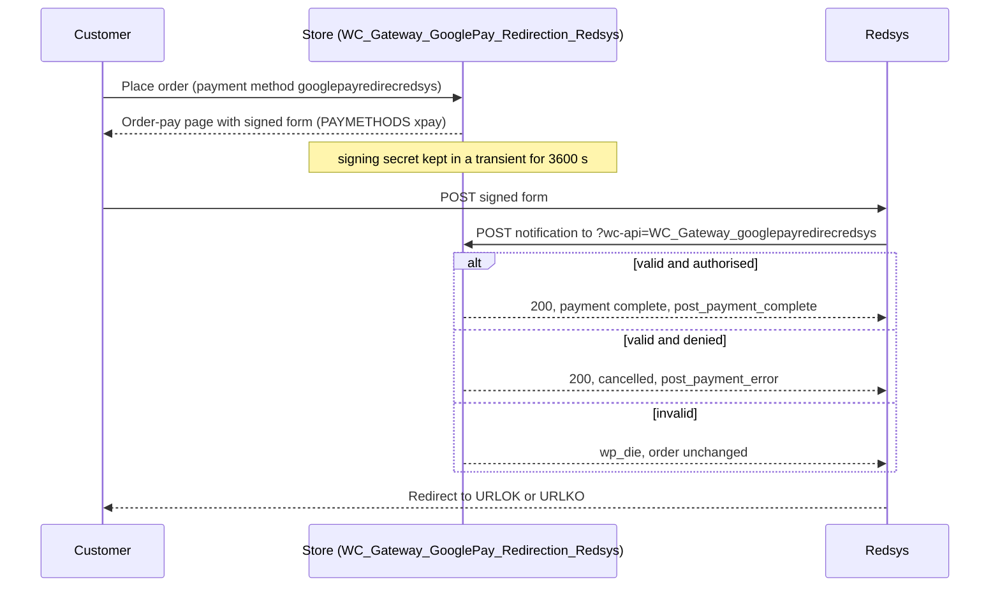

# Flow — Google Pay by redirection (`googlepayredirecredsys`)

> As-built, written from the code on 2026-10-06. Steps marked *(unverified)* are read from the code and have no automated test.

## Trigger / entry point
A customer chooses the payment method with ID `googlepayredirecredsys` on the WooCommerce checkout and places the order. The wallet itself is shown by Redsys on its hosted page; this plugin does not use the browser Payment Request API.

## Actors
- **Customer** — browser and wallet.
- **Store** — WordPress + WooCommerce + this plugin (`WC_Gateway_GooglePay_Redirection_Redsys`).
- **Redsys** — the hosted page and the notification sender.

## Preconditions
- The gateway is enabled and the store currency is in the allowed list (`is_valid_for_use()`).
- The gateway is visible to this visitor (`show_payment_method()`, see "Branches").
- A SHA-256 secret is configured for the active mode; without one every notification is rejected (`AC-27`).

## Steps

1. **Customer → Store:** places the order. WooCommerce creates it `pending`; `process_payment()` returns a redirect to the order-pay URL.
2. **Store → Customer:** `woocommerce_receipt_googlepayredirecredsys` runs `receipt_page()`, which prints the form built by `generate_redsys_form()`.
3. **Store (building the request):** `get_redsys_args( $order )` builds the same parameter set as Bizum with `DS_MERCHANT_PAYMETHODS` fixed to `xpay`, signs it, stores the signing secret in the transient `redsys_signature_<Redsys order number>` for 3600 seconds, and passes the three signed fields through the filter `woocommerce_googlepayredirecredsys_args`.
4. **Store → Customer:** the form posts `Ds_SignatureVersion`, `Ds_MerchantParameters` and `Ds_Signature` to the Redsys test or live host and is auto-submitted (`AC-25`).
5. **Customer → Redsys:** pays with the wallet.
6. **Redsys → Store:** posts the notification to `?wc-api=WC_Gateway_googlepayredirecredsys`. Continues in `docs/flows/notification-handling.md`.
7. **Redsys → Customer → Store:** returns the customer to the order-received URL or to the cancel-order URL.

## Order states

| From | Event | To |
|------|-------|----|
| — | order placed | `pending` |
| `pending` | accepted notification, authorised, amount matches | status set by `payment_complete()` (`AC-29`); action `googlepayredirecredsys_post_payment_complete` fires (`AC-32`) |
| `pending` | accepted notification, authorised, amount differs | `on-hold` (`AC-31`) |
| `pending` | accepted notification, denied | `cancelled`; action `googlepayredirecredsys_post_payment_error` fires (`AC-31`, `AC-32`) |
| `pending` | notification rejected, or none arrives | stays `pending` |

This gateway has no `orderdo` setting. The property is read from the stored settings, where the settings screen never writes it, so the order is not forced to `completed` here unless the key was stored by other means.

## Branches and conditions
- **Visibility in test mode (`show_payment_method()` / `check_user_show_payment_method()`):** outside test mode the gateway is shown to everyone. In test mode it reads the stored setting `testshowgateway`: a list of user IDs shows it only to those logged-in users; when the key is absent or holds no usable entry it is shown to everyone. The Lite settings screen has no field for this key, so on a store configured through the settings screen the gateway is offered in test mode like the other gateways (`AC-33`; corrected in S-035, D-052 — it used to be hidden from everyone).
- **Signing secret (`get_redsys_sha256()`):** in test mode, `customtestsha256` when filled in, otherwise a generic Redsys test secret built into the class; in live mode, `secretsha256`.
- **Per-user test mode:** `check_user_test_mode()` always returns `false` in this class.
- **Blocks checkout:** registered by `WC_Gateway_GooglePay_Redirection_Redsys_Support` (`AC-46`, *unverified*).
- **Test-mode banner:** `warning_checkout_test_mode_bizum()` (the method keeps the Bizum name) on `woocommerce_before_checkout_form`.

## Failure paths and recovery
- **Customer abandons or the wallet payment is refused:** return to the cancel-order URL, sent as a plain URL (`AC-62`); a denied notification cancels the order, stores the Redsys error text, empties the cart and fires `googlepayredirecredsys_post_payment_error`. Whichever arrives first, the customer sees WooCommerce's "Your order was cancelled." notice (`AC-63`).
- **Notification rejected:** the `redsys_signature_<number>` transient is deleted and the order stays `pending`.
- **Return to the order-received page while the order is still unpaid:** the shared fallback calls this gateway's `successful_request()` with `Ds_SignatureVersion`, `Ds_MerchantParameters` and `Ds_Signature` taken from the return URL. A correctly signed return completes the payment; anything else leaves the order unchanged (`AC-60`; corrected in S-035, D-052 — the signature version used not to be forwarded and this class stopped the page).

## Diagram

## Acceptance criteria covered
`AC-25`, `AC-33`, `AC-46`; the notification half is `AC-26` to `AC-32`.

## Source files
- `classes/class-wc-gateway-googlepay-redirection-redsys.php` — `__construct()` line 190, `init_form_fields()` 308, `check_user_test_mode()` 402, `get_redsys_url_gateway()` 491, `get_redsys_sha256()` 564, `get_redsys_args()` 615, `generate_redsys_form()` 734, `process_payment()` 788, `receipt_page()` 801, `warning_checkout_test_mode_bizum()` 1617, `check_user_show_payment_method()` 1638, `show_payment_method()` 1674.
- `classes/class-wc-gateway-redsys-global-lite.php` — `prepare_order_number()` line 1148, `get_redsys_option()` 51.
- `includes/class-redsysliteapi.php` — request encoding and signature.
- `includes/blocks/class-wc-gateway-googlepay-redirection-redsys-support.php` — Blocks registration.
