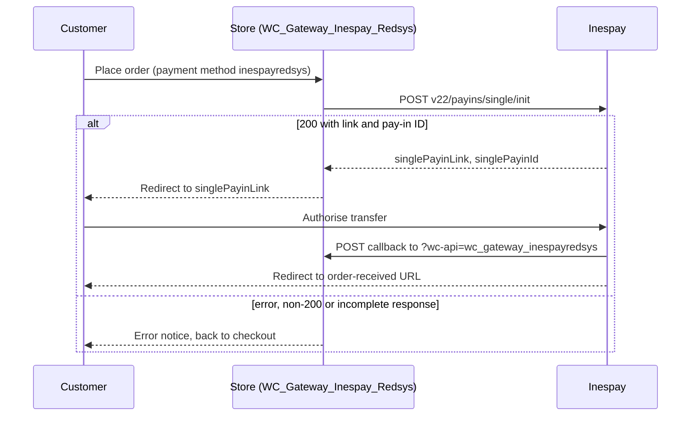

# Flow — Inespay bank transfer (`inespayredsys`)

> As-built, written from the code on 2026-10-06. Steps marked *(unverified)* are read from the code and have no automated test.

## Trigger / entry point
A customer chooses the payment method with ID `inespayredsys` on the WooCommerce checkout and places the order.

## Actors
- **Customer** — browser and online banking.
- **Store** — WordPress + WooCommerce + this plugin (`WC_Gateway_Inespay_Redsys`).
- **Inespay** — the pay-in API, the hosted bank-authorisation page and the callback sender.

## Preconditions
- The gateway is enabled and the customer's country is `ES`, `PT` or `IT` (`is_available()` → `is_allowed_country()`, `AC-43`).
- When `transactionlimit` is set, the amount to pay is not above it: the cart total, or the order total on the order-pay page (`disable_inespay()`, `AC-44`). `process_payment()` checks the order total again and refuses an order above the limit with an error notice (`AC-70`).
- `api_key` and `api_token` are configured.

## Steps

1. **Customer → Store:** places the order. WooCommerce creates it `pending` and calls `process_payment( $order_id )`.
2. **Store → Inespay:** `process_payment()` sends a JSON `POST` to the Inespay endpoint `v22/payins/single/init` — the sandbox base URL when `testmode` is `yes`, the production base URL otherwise — with the headers `X-Api-Key` and `Authorization`, a 30-second timeout, and this body: `amount` (order total in minor units), `currency` (`EUR`), `description`, `reference` (from `WCRedL()->prepare_order_number()`), `successLinkRedirect` (order-received URL), `abortLinkRedirect` (checkout URL), both redirect methods `GET`, `notifUrl` (the callback URL) and `notifUrlContentType` (`json`); plus `expiration` and `creditorAccount` when those settings are filled in.
3. **Inespay → Store:** answers with `singlePayinLink` and `singlePayinId`.
4. **Store:** saves `_inespay_single_payin_id`, `_inespay_status` (`initiated`), `_inespay_reference` and, when sent, `_inespay_creditor_account` in order meta, and returns `result: success` with the pay-in link as the redirect (`AC-34`).
5. **Customer → Inespay:** authorises the transfer in their bank.
6. **Inespay → Store:** posts the callback to `?wc-api=wc_gateway_inespayredsys`. Continues in `docs/flows/notification-handling.md` (Inespay section).
7. **Inespay → Customer → Store:** returns the customer to the order-received URL, or to the checkout URL when the customer aborts.

Unlike the three Redsys-protocol gateways there is no order-pay page and no form: the redirect in step 4 goes straight from the checkout to Inespay.

## Order states

| From | Event | To |
|------|-------|----|
| — | order placed | `pending` |
| `pending` | signed callback `OK`/`SETTLED`, amount and currency match | status set by `payment_complete()`; then `completed` when `orderdo` is `completed` (`AC-38`) |
| `pending` | signed callback `OK`/`SETTLED`, amount differs | `on-hold` (`AC-39`) |
| `pending` | signed callback `OK`/`SETTLED`, order currency is not EUR | `on-hold` (`AC-41`) |
| `pending` | signed callback with another status | unchanged; note and meta only (`AC-42`) |
| `pending` | callback rejected, or none arrives | stays `pending` |

## Branches and conditions
- **Country gate:** the shipping country is used when present, otherwise the billing country, otherwise the store base country. The same rule is repeated in the Blocks integration (`WC_Gateway_Inespay_Lite_Support::is_active()`).
- **Transaction limit:** on the front-end checkout, with a limit above zero, Inespay is removed when the cart total is greater than the limit; both are compared as decimals.
- **Environment:** `testmode` `yes` selects the sandbox environment, anything else production.
- **Blocks checkout:** registered by `WC_Gateway_Inespay_Lite_Support` (`AC-46`, *unverified*).
- **Test-mode banner:** `warning_checkout_test_mode_inespay()` exists in the class but is not attached to any hook, so no banner is shown for this gateway.

## Failure paths and recovery
All of these return `result: failure` with a redirect to the checkout URL and show an error notice; the order stays `pending` and the customer can try again or choose another method (`AC-35`, *unverified*).
- **API key or API token missing:** notice "Payment error: Inespay credentials are missing." No request is sent.
- **The request fails** (`WP_Error`), **the status is not 200**, or **the response lacks `singlePayinLink` or `singlePayinId`:** notice "Could not start payment with Inespay. Please try again or use another method."
- **Customer aborts at Inespay:** returned to the checkout URL.

## Diagram

## Acceptance criteria covered
`AC-34`, `AC-35`, `AC-43`, `AC-44`, `AC-46`; the callback half is `AC-36` to `AC-42`.

## Source files
- `classes/class-wc-gateway-inespay-redsys.php` — `__construct()` line 117, `is_allowed_country()` 163, `is_available()` 183, `disable_inespay()` 236, `init_form_fields()` 312, `process_payment()` 403, `get_api_url()` 810, `warning_checkout_test_mode_inespay()` 839.
- `classes/class-wc-gateway-redsys-global-lite.php` — `prepare_order_number()` line 1154, `redsys_amount_format()` 1174, `update_order_meta()` 203.
- `includes/blocks/class-wc-gateway-inespay-lite-support.php` — Blocks registration and the country rule.
- `.wp-env-mu-plugins/inespay-http-stub.php` — test-only stub of the Inespay API used by the end-to-end test; not shipped.
