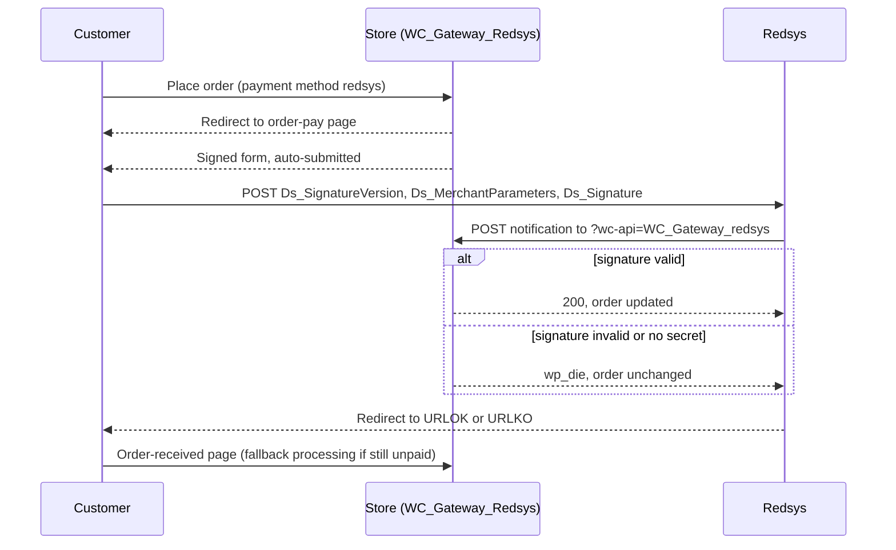

# Flow — Card payment by Redsys redirection (`redsys`)

> As-built, written from the code on 2026-10-06. Steps marked *(unverified)* are read from the code and have no automated test; see the `uncovered` criteria in `docs/02-functional-spec.md`.

## Trigger / entry point
A customer chooses the payment method with ID `redsys` on the WooCommerce checkout — classic shortcode checkout or Blocks checkout — and places the order.

## Actors
- **Customer** — browser.
- **Store** — WordPress + WooCommerce + this plugin (`WC_Gateway_Redsys`).
- **Redsys** — the hosted payment page and the notification sender.

## Preconditions
- The gateway is enabled and the store currency is in the allowed list (`is_valid_for_use()`); otherwise the constructor disables the gateway (`AC-16`).
- A SHA-256 secret is configured for the active mode. Without one the form is still generated, but every notification is rejected (`AC-07`), so the order never leaves `pending`.

## Steps

1. **Customer → Store:** places the order. WooCommerce creates it with status `pending` and calls `process_payment( $order_id )`, which returns `result: success` and a redirect to the order-pay URL (`$order->get_checkout_payment_url( true )`).
2. **Store → Customer:** the order-pay page fires `woocommerce_receipt_redsys`, handled by `receipt_page()`. It prints a short message and the form built by `generate_redsys_form()`.
3. **Store (building the request):** `get_redsys_args( $order )`:
   - creates the Redsys order number with `WCRedL()->prepare_order_number()` — 12 characters, and a mapping transient `redys_order_temp_<number>` kept for one hour (`AC-05`);
   - sets the request parameters: `DS_MERCHANT_AMOUNT` (order total without a decimal separator), `DS_MERCHANT_ORDER`, `DS_MERCHANT_MERCHANTCODE` (setting `customer`), `DS_MERCHANT_CURRENCY`, `DS_MERCHANT_TRANSACTIONTYPE` `0`, `DS_MERCHANT_TERMINAL`, `DS_MERCHANT_MERCHANTURL` (the notification URL), `DS_MERCHANT_TITULAR`, `DS_MERCHANT_URLOK` (order-received URL plus `utm_nooverride=1`), `DS_MERCHANT_URLKO` (cancel-order URL), `DS_MERCHANT_CONSUMERLANGUAGE`, `DS_MERCHANT_PRODUCTDESCRIPTION`, `DS_MERCHANT_MERCHANTNAME`, `DS_MERCHANT_PAYMETHODS` (setting `payoptions`) and `Ds_Merchant_EMV3DS` (the PSD2 block from `WCPSD2L()->get_acctinfo()`);
   - adds `DS_MERCHANT_EXCEP_SCA` = `LWV` when `lwvactive` is `yes` and the amount is 3000 or less in minor units (30.00);
   - encodes the parameters and signs them (`AC-02`);
   - passes the three resulting fields through the filter `woocommerce_redsys_args`.
4. **Store → Customer:** the form `#redsys_payment_form` carries the hidden fields `Ds_SignatureVersion` (`HMAC_SHA256_V1`), `Ds_MerchantParameters` and `Ds_Signature`, and posts to the Redsys redirection URL — the test host when `testmode` is `yes`, the live host otherwise (`AC-01`). An inline script attached to the `woocommerce` script handle blocks the page and clicks the submit button, so the customer is forwarded without acting. A "Cancel order & restore cart" link is printed beside the button.
5. **Customer → Redsys:** pays on the hosted page. Nothing in this plugin runs.
6. **Redsys → Store:** posts the notification to `DS_MERCHANT_MERCHANTURL`. Continues in `docs/flows/notification-handling.md`.
7. **Redsys → Customer → Store:** sends the customer back to `DS_MERCHANT_URLOK` (payment accepted) or `DS_MERCHANT_URLKO` (payment refused or abandoned).

## Order states

| From | Event | To |
|------|-------|----|
| — | order placed | `pending` |
| `pending` | accepted notification, authorised, amount matches | status set by WooCommerce's `payment_complete()`; then `completed` when `orderdo` is `completed` (`AC-09`) |
| `pending` | accepted notification, authorised, amount differs | `on-hold` (`AC-10`) |
| `pending` | accepted notification, denied | `cancelled` (`AC-11`) |
| `pending` | notification rejected, or none arrives | stays `pending` |

## Branches and conditions
- **Which secret signs the request:** in test mode, `customtestsha256` when it is filled in, otherwise `secretsha256`; in live mode, `secretsha256`.
- **Which notification URL is sent:** the `http:` variant when `not_use_https` is `yes`, otherwise the site's own scheme.
- **Language of the hosted page:** with WPML active (`SitePress` class present) it follows the current WPML language and the `redsyslanguage` setting is ignored; otherwise `redsyslanguage`, falling back to `001`.
- **Blocks checkout:** the gateway is registered by `WC_Gateway_Redsys_Lite_Support`; from step 1 onward the flow is the same (`AC-45`).
- **Test-mode banner:** while `testmode` is `yes` and the gateway is enabled, `warning_checkout_test_mode()` prints a warning above the checkout form (`AC-15`).

## Failure paths and recovery
- **Customer cancels or the card is refused:** Redsys returns the customer to the cancel-order URL, sent as a plain URL (`AC-62`); a denied notification also cancels the order and empties the cart (`AC-11`). Whichever of the two arrives first, the customer sees WooCommerce's "Your order was cancelled." notice (`AC-63`) and can check out again.
- **No secret configured:** the form is generated and Redsys may accept the payment, but the notification is rejected. Recovery: configure the secret; the store owner then reconciles the order by hand.
- **Notification never arrives** (blocked by a firewall, or an HTTPS certificate Redsys does not accept): the order stays `pending`. The return handler on the order-received page is the fallback (`AC-13`); `not_use_https` exists for the certificate case.
- **Amount mismatch:** the order goes `on-hold` for a manual check (`AC-10`).

## Diagram

## Acceptance criteria covered
`AC-01`, `AC-02`, `AC-05`, `AC-15`, `AC-16`, `AC-45`; the notification half is `AC-03`, `AC-04`, `AC-06` to `AC-14` (see `docs/flows/notification-handling.md`).

## Source files
- `classes/class-wc-gateway-redsys.php` — `__construct()` line 238, `is_valid_for_use()` 331, `get_redsys_args()` 572, `generate_redsys_form()` 710, `process_payment()` 808, `receipt_page()` 820, `warning_checkout_test_mode()` 1433.
- `classes/class-wc-gateway-redsys-global-lite.php` — `prepare_order_number()` line 1154.
- `classes/class-wc-gateway-redsys-psd2-light.php` — `get_acctinfo()` line 571.
- `includes/class-redsysliteapi.php` — `create_merchant_parameters()` line 172, `create_merchant_signature()` 185.
- `includes/blocks/class-wc-gateway-redsys-lite-support.php` — Blocks registration.
- `woocommerce-redsys.php` — gateway registration (`woocommerce_add_gateway_redsys_gateway()`, line 271).
