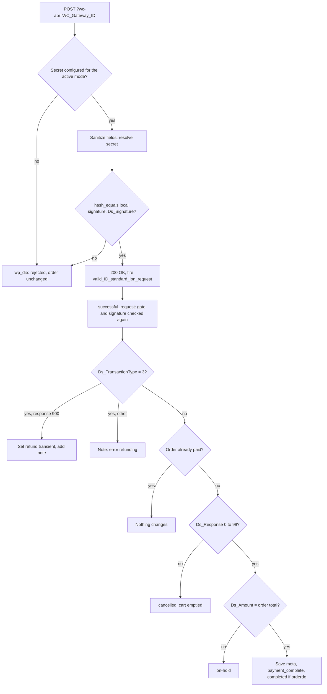
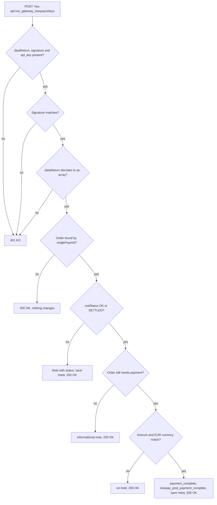

# Flow — Notification handling: signature validation to order status

> As-built, written from the code on 2026-10-06. Steps marked *(unverified)* are read from the code and have no automated test.

Three entry points are covered here:

- **A.** The Redsys notification, for `redsys`, `bizumredsys` and `googlepayredirecredsys`.
- **B.** The Inespay callback, for `inespayredsys`.
- **C.** The fallback on the order-received page, for the three Redsys-protocol gateways.

Request and response details for each endpoint are in `docs/reference/endpoints.md`.

## Actors
- **Redsys / Inespay** — server-to-server sender. Not a WordPress user: no login, no nonce. The signature is the only authentication.
- **Store** — WooCommerce's `wc-api` dispatcher and the gateway class.
- **Third-party code** — listeners on the plugin's actions.

---

## A. Redsys notification (`redsys`, `bizumredsys`, `googlepayredirecredsys`)

### Trigger / entry point
A `POST` to `?wc-api=WC_Gateway_<gateway id>` with `Ds_SignatureVersion`, `Ds_MerchantParameters` and `Ds_Signature`. WooCommerce fires `woocommerce_api_wc_gateway_<gateway id>`, which each class attaches to `check_ipn_response()`.

### Steps

1. **Store:** `check_ipn_response()` clears the output buffer and calls `check_ipn_request_is_valid()`.
2. **Store (gate):** picks the settings secret for the active mode — in test mode `customtestsha256` when filled in, otherwise `secretsha256`; in live mode `secretsha256`. If it is empty the notification is rejected (`AC-07`, `AC-19`, `AC-27`). Google Pay also rejects at this point when any of the three fields is missing.
3. **Store (clean the input):** `Ds_MerchantParameters` goes through `RedsysLiteAPI::sanitize_merchant_parameters()` (`AC-04`); the other two fields through `sanitize_text_field()`.
4. **Store (resolve the secret):**
   - `redsys`: the secret from step 2.
   - `bizumredsys` and `googlepayredirecredsys`: `resolve_notification_secret()` decodes the parameters, reads `Ds_Order`, and takes, in this order, the order meta `_redsys_secretsha256`, the checkout transient `redsys_signature_<Ds_Order>`, or `get_redsys_sha256()` for the order's user. An order ID that does not exist is caught and treated as a guest (`AC-22`, `AC-30`).
5. **Store (verify):** computes `create_merchant_signature_notif( $secret, $data )` and compares it with `Ds_Signature` using `hash_equals()` (`AC-03`, `AC-06`, `AC-08`, `AC-18`, `AC-20`, `AC-26`, `AC-28`).
6. **Store (dispatch):** on success sends `HTTP/1.1 200 OK` and fires `valid_<gateway id>_standard_ipn_request` with the posted data. On failure calls `wp_die()` with a short text; Bizum and Google Pay first delete the `redsys_signature_<Ds_Order>` transient.
7. **Store (process):** each class listens to its own action with `successful_request( $params )`, which **repeats** the gate and the signature check before touching the order — it returns silently when either fails (`AC-21`, `AC-29`).
8. **Store (find the order):** `WCRedL()->clean_order_number( Ds_Order )` maps the Redsys order number back to the order ID (`AC-05`).
9. **Store (decide):** see the decision table.

### Decision table (step 9)

| Condition, checked in this order | Outcome | Criteria |
|---|---|---|
| `Ds_TransactionType` is `3` and `Ds_Response` is `900` | Sets the transient `<order id>_redsys_refund` to `yes`, adds a "refunded" note, returns. The order status is not changed here. | `AC-50` |
| `Ds_TransactionType` is `3`, any other response | Adds the note "There was an error refunding" and ends the request. | `AC-52` |
| The order is already paid (`WCRedL()->is_paid()`) | Ends the request; nothing changes. | `AC-12`, `AC-23`, `AC-59` |
| `Ds_Response` is 0–99 and `Ds_Amount` differs from the order total | Order `on-hold` with a note showing both amounts; ends the request. | `AC-10`, `AC-23`, `AC-31` |
| `Ds_Response` is 0–99 and the amount matches | Saves the payment meta, adds the notes "HTTP Notification received - payment completed" and "Authorization code: …", calls `payment_complete()`, then `completed` when `orderdo` is `completed`. Google Pay then fires `googlepayredirecredsys_post_payment_complete`. | `AC-09`, `AC-21`, `AC-29`, `AC-32` |
| `Ds_Response` is above 99 | Order `cancelled` with a note; the cart is emptied. Bizum and Google Pay also store the Redsys error text in `_redsys_error_payment_ds_response_value`; Google Pay then fires `googlepayredirecredsys_post_payment_error`. | `AC-11`, `AC-23`, `AC-31`, `AC-32` |

"Already paid" means the order status is **not** one of the statuses returned by `get_status_pending()` — by default `pending`, `redsys-pbankt`, `cancelled` and `pending-deposit`, changeable with the filter `redsys_status_pending`. An `on-hold` order therefore counts as paid. Google Pay's `successful_request()` has no already-paid check.

Amounts are compared as strings of minor units with leading zeros removed.

### Order meta written on a completed payment

| Meta key | `redsys` | `bizumredsys` | `googlepayredirecredsys` |
|---|---|---|---|
| `_payment_order_number_redsys` | yes | yes | yes |
| `_payment_date_redsys`, `_payment_hour_redsys` | yes | yes | yes |
| `_order_fuc_redsys`, `_authorisation_code_redsys` | yes | yes | yes |
| `_card_country_redsys` | yes | yes | yes |
| `_card_type_redsys` | yes | yes | — |
| `_payment_terminal_redsys`, `_corruncy_code_redsys` | — | yes | yes |
| `_redsys_secretsha256` (the signing secret, in clear, when the checkout transient still exists) | — | yes | yes |

The last row is the known, deliberately deferred finding D-025 (`docs/decisions.md`, `docs/threat-model.md`).

### Failure paths and recovery
- **No secret, bad signature, tampered payload:** `wp_die()`; the order is untouched. Redsys treats the notification as failed. Recovery is on the merchant side: fix the secret, then reconcile the order by hand.
- **Order number cannot be mapped:** the legacy rule strips the first three characters and the leading zeros. In `redsys`, an ID that matches no order makes `new WC_Order()` throw inside `successful_request()` *(unverified — no test covers the card gateway past the signature check)*.
- **Duplicate notification:** ignored by the already-paid check in all three classes (Google Pay since S-035, `AC-59`).

### Diagram

---

## B. Inespay callback (`inespayredsys`)

### Trigger / entry point
A `POST` to `?wc-api=wc_gateway_inespayredsys`. WooCommerce fires `woocommerce_api_wc_gateway_inespayredsys`, attached to `handle_callback()`.

### Steps

1. **Store (read the body):** reads the raw request body and decodes it as JSON; when that yields nothing, parses it as a form-encoded string; when that yields nothing either, uses `$_POST`.
2. **Store (gate):** takes `dataReturn` and the signature from the first non-empty of `signatureDataReturn`, `signature_data_return`, `signature`. If `dataReturn`, the signature or the configured `api_key` is empty, answers `401` with the body `KO` (`AC-36`).
3. **Store (verify):** computes `base64( hex HMAC-SHA256 of dataReturn keyed with api_key )` and compares it with the received signature using `hash_equals()`. A mismatch answers `401` `KO` (`AC-37`).
4. **Store (decode):** Base64-decodes `dataReturn` and parses it as JSON. If it is not an array, answers `401` `KO`. The decoded fields override anything else in the request.
5. **Store (find the order):** looks up the order whose meta `_inespay_single_payin_id` equals `singlePayinId`. A missing ID or an unknown order answers `200` `OK` and changes nothing — deliberately, so Inespay does not retry.
6. **Store (decide):** see the decision table.
7. **Store (persist):** unless the request ended earlier, saves `_inespay_single_payin_id`, `_inespay_status`, `_inespay_debtor_account`, `_inespay_debtor_name`, `_inespay_reference` and `_inespay_creditor_account` for each field present, and answers `200` `OK`.

### Decision table (step 6)

| Condition, checked in this order | Outcome | Criteria |
|---|---|---|
| `codStatus` is `OK` or `SETTLED` and the order no longer needs payment | Informational note only; `200` `OK`. | `AC-40` |
| `codStatus` is `OK` or `SETTLED` and `amount` differs from the order total in minor units | Order `on-hold` with a note; `200` `OK`. | `AC-39` |
| `codStatus` is `OK` or `SETTLED` and the order currency is not `EUR` | Order `on-hold` with a note; `200` `OK`. | `AC-41` |
| `codStatus` is `OK` or `SETTLED`, amount and currency fine | `payment_complete()`, note "Inespay payment completed…", `completed` when `orderdo` is `completed`, meta `_payment_method` and `_redsys_done`, then the action `inespay_post_payment_complete` with the order ID. | `AC-38` |
| Any other `codStatus`, or none | Note "Inespay callback received with status: …"; the order status is unchanged. | `AC-42` |

A refund confirmation arrives on the same URL. Because the order no longer needs payment by then, it falls in the first row.

### Diagram

---

## C. Fallback on the order-received page

### Trigger / entry point
The customer's browser lands on the WooCommerce order-received page with both `key` and `Ds_MerchantParameters` in the query string. `redsyslite_force_mark_order_as_paid_on_thankyou_page()` runs on `wp_head`.

### Steps

1. **Store:** resolves the order ID from `key` with `wc_get_order_id_by_order_key()`; stops if there is none.
2. **Store (rate limit):** `redsyslite_mark_order_as_paid()` stops if the transient `redsyslite_mark_paid_attempt_<order id>` exists; otherwise sets it for 30 seconds (`AC-14`).
3. **Store:** clears the order caches and stops if the order is already paid — the usual case, because the notification normally arrives first (`AC-14`).
4. **Store:** waits 5 seconds, clears the caches again and re-reads the order.
5. **Store:** if the order exists, was paid with `redsys`, `bizumredsys` or `googlepayredirecredsys`, and is still unpaid, calls that gateway's `successful_request()` with `Ds_MerchantParameters` and `Ds_Signature` taken from the URL. From there the flow is part A from step 7, so the signature is verified before anything changes (`AC-13`, *unverified*).

### Conditions and failure paths
- Inespay orders never enter step 5: `inespayredsys` is not in `redsys_return_types()`.
- The fallback does not pass `Ds_SignatureVersion`. `redsys` and `bizumredsys` tolerate that; `googlepayredirecredsys` calls `wp_die()` when the field is missing (`classes/class-wc-gateway-googlepay-redirection-redsys.php` line 941), which stops the order-received page while it is being rendered *(unverified — read from the code, not reproduced)*.
- Branches of `successful_request()` that end the request (amount mismatch, refund error) also end the page render when they are reached through this fallback *(unverified)*.

---

## Acceptance criteria covered
Part A: `AC-03` to `AC-12`, `AC-18` to `AC-23`, `AC-26` to `AC-32`, and the refund notification rows `AC-50`, `AC-52`. Part B: `AC-36` to `AC-42`. Part C: `AC-13`, `AC-14`.

## Source files
- `classes/class-wc-gateway-redsys.php` — `check_ipn_request_is_valid()` line 833, `check_ipn_response()` 898, `successful_request()` 914.
- `classes/class-wc-gateway-bizum-redsys.php` — `resolve_notification_secret()` line 983, `check_ipn_request_is_valid()` 1015, `check_ipn_response()` 1086, `successful_request()` 1109.
- `classes/class-wc-gateway-googlepay-redirection-redsys.php` — `check_ipn_request_is_valid()` line 845, `check_ipn_response()` 904, `successful_request()` 926.
- `classes/class-wc-gateway-inespay-redsys.php` — `handle_callback()` line 454, `get_order_by_payin_id()` 762.
- `classes/class-wc-gateway-redsys-global-lite.php` — `get_status_pending()` line 865, `is_paid()` 879, `clean_order_number()` 1093, `get_order_id_by_redsys_order_number()` 1111.
- `includes/class-redsysliteapi.php` — `sanitize_merchant_parameters()` line 139, `decode_merchant_parameters()` 257, `create_merchant_signature_notif()` 270.
- `includes/data/redsys-status-paid.php`, `includes/data/redsys-types.php` — the unpaid-status list and the gateway list.
- `woocommerce-redsys.php` — `redsyslite_bust_order_cache()` line 384, `redsyslite_mark_order_as_paid()` 401, `redsyslite_force_mark_order_as_paid_on_thankyou_page()` 457.
