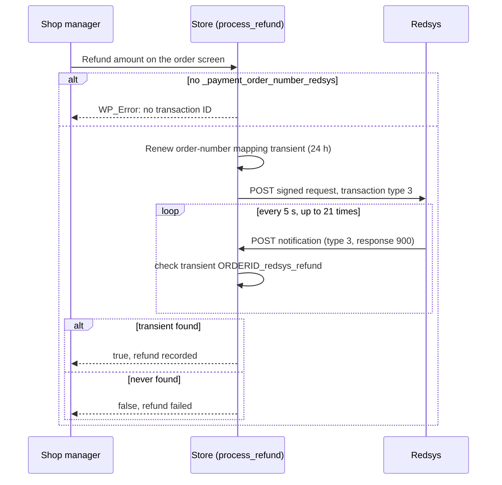
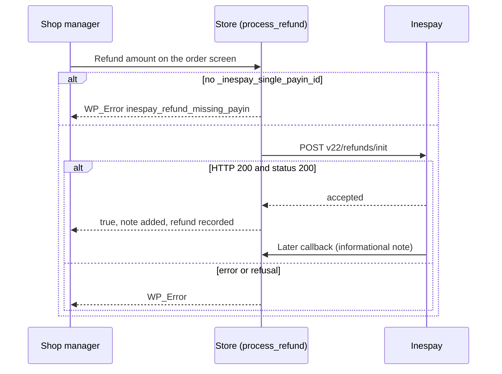

# Flow — Refund from the WooCommerce order screen

> As-built, written from the code on 2026-10-06. Steps marked *(unverified)* are read from the code and have no automated test. No refund has been driven against Redsys or Inespay in this project: the request shapes below are what the code sends, not a confirmation that the remote side accepts them.

## Trigger / entry point
A shop manager opens a paid order in WooCommerce, enters a refund amount and uses the "Refund via <gateway>" button. WooCommerce calls the gateway's `process_refund( $order_id, $amount, $reason )`. All four gateways declare `refunds` in `supports`.

## Actors
- **Shop manager** — a WordPress user allowed to refund orders in WooCommerce.
- **Store** — WooCommerce and the gateway class.
- **Redsys** or **Inespay** — the processor.

Two different shapes exist: a synchronous wait for a notification (A), and a single API call (B).

---

## A. Redsys card, Bizum and Google Pay redirection

### Preconditions
- The order holds the meta `_payment_order_number_redsys`, written when the payment notification was processed.
- The site can receive the refund notification on the gateway's notification URL while the request is still running.

### Steps

1. **Shop manager → Store:** submits the refund.
2. **Store:** `process_refund()` removes the PHP time limit and reads `_payment_order_number_redsys`. If it is empty, returns `WP_Error` "Refund Failed: No transaction ID" (`AC-52`).
3. **Store (amount):** when `$amount` is empty, uses the full order total; otherwise formats `$amount` in minor units.
4. **Store (clean slate):** deletes any confirmation transient `<order id>_redsys_refund` left from an earlier refund of this order, so that only a confirmation arriving from here on counts (`AC-69`). Done in the same step as the mapping below, before the request leaves.
4b. **Store (mapping):** saves the transient `redys_order_temp_<Redsys order number>` → order ID again, for 24 hours, so the refund notification resolves to this order (`AC-51`).
5. **Store → Redsys:** `ask_for_refund()` builds a request with `DS_MERCHANT_TRANSACTIONTYPE` `3`, the same Redsys order number, the amount, merchant code, currency, terminal and the notification URL, signs it, and sends it with `wp_remote_post()` (45-second timeout):
   - `redsys` posts to the Redsys REST endpoint (`get_redsys_url_gateway_rest()`), signed with the settings secret for the active mode;
   - `bizumredsys` and `googlepayredirecredsys` post to the URL returned by `get_redsys_url_gateway()` — the same redirection URL the checkout form uses — signed with the order meta `_redsys_secretsha256` when present, otherwise `get_redsys_sha256()`. They take the terminal from the order meta `_payment_terminal_redsys`.
   A `WP_Error` from the request is returned to WooCommerce as `WP_Error` (`AC-52`). The HTTP status and body of the answer are not inspected.
6. **Redsys → Store:** posts a notification with `Ds_TransactionType` `3` to the notification URL. It goes through the full validation in `docs/flows/notification-handling.md`; with `Ds_Response` `900` the handler calls `set_refund_confirmed()`, which sets the transient `<order id>_redsys_refund` to `yes` for 10 minutes, and adds the note "Order Payment refunded" ("Order Payment refunded by Redsys" for Google Pay).
7. **Store (wait):** meanwhile `process_refund()` sleeps 5 seconds and calls `check_redsys_refund()`, which reads that transient; it repeats up to 21 times, about 105 seconds in total (`AC-50`). The 20 further looks after the first can be changed with the filter `woocommerce_<gateway id>_refund_confirmation_attempts`.
8. **Store → Shop manager:** when the transient appears, deletes it and returns `true`; WooCommerce records the refund. When it never appears, returns `false` and WooCommerce reports the refund as failed (`AC-52`).

### States

| Refund outcome | What the order shows |
|---|---|
| Confirmed within the wait | WooCommerce refund recorded; note "Order Payment refunded". The gateway does not change the order status itself. |
| Redsys answers with a response other than `900` | Note "There was an error refunding"; the wait runs out and the refund fails. |
| No notification within the wait | Refund fails. If Redsys did process it, the notification that arrives later still sets the transient and adds the note, but no WooCommerce refund record is created *(unverified)*. |

### Branches and conditions
- **Amount of zero:** an explicit amount of zero (or one that rounds to zero cents, or a negative one) returns an error and sends nothing to Redsys, in all three classes; no amount at all still means the full order total (`AC-58`; corrected in S-035, D-052). Inespay sends the explicit `0` instead (`AC-53`).
- **Currency:** the order meta `_corruncy_code_redsys` when present, otherwise the store currency. The card gateway never writes that meta, so it always uses the store currency.
- **Test or live:** the same mode logic as the checkout request.

### Failure paths and recovery
- **No stored Redsys order number** (the order was never confirmed by a notification): the refund cannot be sent; refund from the Redsys merchant panel instead.
- **Request error:** shown to the shop manager; nothing was sent, so retrying is safe.
- **Timeout without confirmation:** check the Redsys merchant panel before retrying, to avoid a double refund.

### Diagram

---

## B. Inespay

### Preconditions
The order holds the meta `_inespay_single_payin_id`, written at checkout.

### Steps

1. **Shop manager → Store:** submits the refund.
2. **Store:** `process_refund()` reads `_inespay_single_payin_id`. If it is empty, returns `WP_Error` `inespay_refund_missing_payin` (`AC-54`).
3. **Store (amount):** uses the order total only when `$amount` is `null`; an explicit `0` stays `0` (`AC-53`).
4. **Store → Inespay:** sends a JSON `POST` to `v22/refunds/init` on the sandbox or production base URL, with the headers `X-Api-Key` and `Authorization`, a 30-second timeout, and the body `singlePayinId`, `amount` (minor units), `description`, `reference` (a new order number from `prepare_order_number()` followed by `-refund`), `okNotifUrl` and `errorNotifUrl` (both the gateway's callback URL, content type `json`), plus `collectingIBAN` when `creditor_account` is set.
5. **Inespay → Store:** answers. A `WP_Error` is returned as is. An HTTP status other than 200, or a body whose `status` is not `200`, returns `WP_Error` `inespay_refund_failed` (`AC-54`).
6. **Store → Shop manager:** adds the note "Inespay refund initiated for <amount> EUR. Payin ID: <id>" and returns `true`; WooCommerce records the refund.
7. **Inespay → Store (later):** the refund confirmation arrives on the callback URL and is handled as an informational note, because the order no longer needs payment (`docs/flows/notification-handling.md`, part B).

The amount in the note is the minor-unit value sent to the API followed by "EUR", not a decimal amount.

### Failure paths and recovery
- **No pay-in ID, API error, or a refusal from the API:** the error is shown to the shop manager and nothing is recorded; retrying is safe.
- **The API accepts the refund but the bank later fails it:** WooCommerce has already recorded the refund in step 6. The later callback only adds a note with its status *(unverified)*; reconciliation is manual.

### Diagram

---

## Acceptance criteria covered
`AC-50`, `AC-51`, `AC-52` (part A); `AC-53`, `AC-54` (part B).

## Source files
- `classes/class-wc-gateway-redsys.php` — `get_redsys_url_gateway_rest()` line 315, `ask_for_refund()` 1091, `check_redsys_refund()` 1244, `process_refund()` 1269; refund branch of `successful_request()` 914.
- `classes/class-wc-gateway-bizum-redsys.php` — `ask_for_refund()` line 1449, `check_redsys_refund()` 1586, `process_refund()` 1613.
- `classes/class-wc-gateway-googlepay-redirection-redsys.php` — `ask_for_refund()` line 1275, `check_redsys_refund()` 1418, `process_refund()` 1444.
- `classes/class-wc-gateway-inespay-redsys.php` — `process_refund()` line 670, `get_api_url()` 751.
- `classes/class-wc-gateway-redsys-global-lite.php` — `get_order_meta()` line 189, `prepare_order_number()` 1141, `redsys_amount_format()` 1161.
